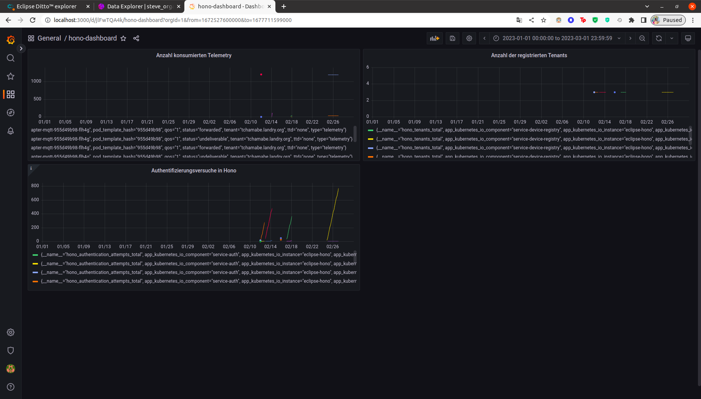

# Vorausetzungen für die Nutzung von Grafana.

<p>Grafana ist eine Open-Source-Plattform zur Visualisierung und Analyse von Daten aus verschiedenen Quellen wie Datenbanken, Cloud-Plattformen, IoT-Geräten und mehr. Die Plattform ermöglicht die Erstellung von interaktiven Dashboards und Diagrammen, um komplexe Daten in übersichtlicher Form darzustellen. Grafana bietet auch Funktionen wie Warnmeldungen, Benutzer-Authentifizierung, Anpassungsmöglichkeiten und Integration mit verschiedenen Datenquellen.</p>
<p> Wir benutzen Grafana in dieser Arbeit, um die Authentifizierung auf Hono zu überwachen, nach der Anzahl der konsommierten Nachrichten auszublicken und noch viel mehr...</p>

Wenn alle Schritte in die Datei [ Voraussetzungen für die Nützung von Eclipse Hono ](../../Vorausetzungen/Hono_Vorausetungen/README.md) durchgeführt wurden, ist dann direkt einen services, der den Endpoint öffnet, um auf Grafana zuzugreifen. </br>

1. Dafur müssen wir einfach den Port forwarden, um den Endpoint zu erreichen.

```bash
kubectl port-forward service/eclipse-hono-grafana 3000 -n hono
```

2. Danach können wir auf der UI zugreifen

http://localhost:3000 

## Ergebniss

Der Dashboard sieht dann so aus:</br>


## Nächste Schritte

die [Voraussetzungen für die Nützung der Roboter-Simulation](../../Vorausetzungen/Roboter_Voraussetzungen/README.md), und die [Voraussetzungen für die Nützung von ditto](../../Vorausetzungen/Ditto_Vorausetzungen/README.md) **müssen** erst duchgeführt werden bevor man wieder die Schritte in [README.md](../../README.md) weiterführen kann.

