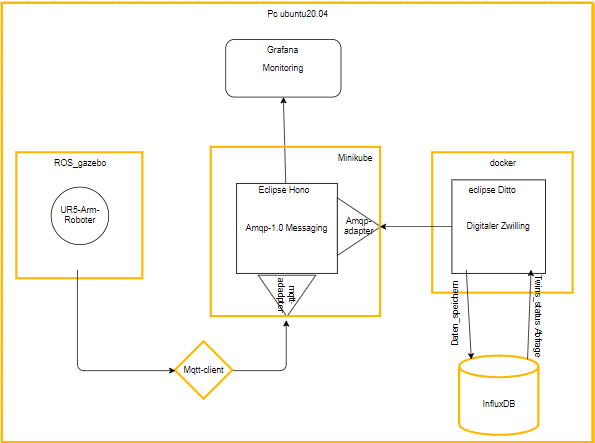

#  Dokumentation zu meiner Bachelorarbeit.

Das Ziel dieses Projekts besteht darin, einen digitalen Zwilling für einen Industrieroboter zu erstellen, speziell für einen kollaborativen Roboterarm (Cobot) vom Typ UR5. Die Implementierung erfolgt auf **Ubuntu 20.04 (Focal)**, da eine Roboter-Simulation in einer ROS-Anwendung verwendet wird. Diese Anwendung erfordert die Verwendung von **[ROS Noetic](http://wiki.ros.org/noetic)**, die nur auf Ubuntu 20.04 zuverlässig ausgeführt werden kann.</br>

Für die Realisierung dieses Projekts wurde folgende Architektur konzipiert:


</br> </br>
- **Hinweis:** Die nachfolgenden schritte müssen erfüllt werden:
    1. [Voraussetzungen für die Nützung von Eclipse Ditto](Vorausetzungen/Ditto_Vorausetzungen/README.md)
    2. [Voraussetzungen für die Nützung von Eclipse Hono](Vorausetzungen/Hono_Vorausetungen/README.md)
    3. [Voraussetzungen für die Nützung von der Roboter-Simulation](Vorausetzungen/Roboter_Voraussetzungen/README.md)
    4. [[Voraussetzungen für die Nützung von dem Mqtt-Client](Vorausetzungen/mqtt-client_vorausetzungen/README.md)

   
1. Geräteregistrierung in Hono

    1. Erstellen eines neues Tenant:

    ```bash
    source envi.env     #siehe Voraussetzungen in Hono dazu
    curl -i -X POST http://100.120.169.61:31148/v1/tenants/tchamabe.landry.org
    #die ID exportieren in die Datei envi.env(in meinen Fall)
    echo "export MY_TENANT=org.eclipse.ditto" >> envi.env
    ```
    die Antwort sieht so aus
    ```sql
    HTTP/1.1 201 Created
    etag: becc93d7-ab0f-48ec-ad26-debdf339cbf4
    location: /v1/tenants/tchamabe.landry.org
    content-type: application/json; charset=utf-8
    content-length: 45

    {"id":"tchamabe.landry.org"}
    ```

    2. Ein neues Gerät zu diesem Tenant hinzufügen:

    ```bash
    source envi.env
    curl -i -X POST http://100.120.169.61:31148/v1/devices/tchamabe.landry.org/my-ur5-arm
    #die ID exportieren in die Datei envi.env(in meinen Fall)
    echo "export MY_DEVICE=my-ur5-arm" >> envi.env
    ```

    die Antwort sieht so aus:
    
    ```sql
    HTTP/1.1 201 Created
    etag: 68eab243-3df9-457d-a0ab-b702e57c0c17
    location: /v1/devices/tchamabe.landry.org/my-ur5-arm
    content-type: application/json; charset=utf-8
    content-length: 45

    {"id":"my-ur5-arm"
    ```

    3. Erstellen und Registrieren eines Passwort für das Gerät

    ```bash
    curl -i -X PUT -H "Content-Type: application/json" --data '[
    {
    "type": "hashed-password",
    "auth-id": "tchamabethesisID",
    "secrets": [{
        "pwd-plain": "tchamabelandry6."
    }]
    }]' http://100.120.169.61:31148/v1/credentials/tchamabe.landry.org/my-ur5-arm
    ```

- **Hinweis**: <p>Bitte beachten Sie, dass es einen Unterschied zwischen dem Benutzernamen des Geräts ( tchamabethesisID) und dem Namen des Geräts ( my-ur5-arm ) gibt. Wenn Sie sich z. B. mit dem MQTT-Protokolladapter verbinden, müssen Sie den vollständig qualifizierten Benutzernamen tchamabethesisID@tchamabe.landry.org ( Authentifizierungs-ID und Mandantenname ) verwenden und nicht nur die Geräte-ID ( my-ur5-arm).</p>

    4. Jetzt starten wir die Infrastruktur:

    ```bash
    source envi.env
    #in dem Verzeichniss, wo wir die Hono-Befehlszeilenclient installiert haben. siehe dazu Voraussetzungen in Hono
    java -jar hono-cli-*-exec.jar app ${APP_OPTIONS} consume --tenant ${MY_TENANT}
    ```
</br>
das Ergebnis sieht dann so aus:

</br>

2. Verbinden wir hono mit dem Roboter

wenn alle [Voraussetzungen für die Nützung der mqtt-client](Vorausetzungen/mqtt-client_vorausetzungen/README.md) erfüllt sind:
bekommen wir als Egebnis:


das Bild zeigt vier Panele: 
        1. Erste(oben Recht) die Hono-Infrastruktur, die eine nachtricht vom Roboter Emfangen hat.</br>
        2. Zweite(oben Link) die Logs von dem gestarteten Roboter.</br>
        3. Dritte(unten recht) der TCP-controler fuer die Steuerung des Roboter.</br>
        4. Vierte (unten links) der Mqtt-client der mit Hono verbunden ist und Nachtricht weiterleitet.</br>

3. bereiten wir Grafana für die Moniitoring der Daten.

siehe dazu den Verzeichnis [Grafana](Monitoring/Grafana/).

4. eine Verbindung zwischen Hono und Ditto erstellen.

    1. Policy Erstellen.

    wir setzen die Policy, um den Zugriff auf dem Thing zu beschränken.</br>
    Erstellen wir die Datei policy.json mit folgendem Inhalt:
    ```json
        {
        "policyId": "tchamabe.landry.org:policy-twin-zugriff",
        "imports": {},
        "entries": {
            "DEFAULT": {
            "subjects": {
                "nginx:ditto": {
                "type": "Ditto user authenticated via nginx"
                }
            },
            "resources": {
                "thing:/": {
                "grant": [
                    "READ",
                    "WRITE"
                ],
                "revoke": []
                },
                "policy:/": {
                "grant": [
                    "READ",
                    "WRITE"
                ],
                "revoke": []
                },
                "message:/": {
                "grant": [
                    "READ",
                    "WRITE"
                ],
                "revoke": []
                }
            },
            "importable": "implicit"
            },
            "HONO": {
            "subjects": {
                "pre-authenticated:hono-connection": {
                "type": "Connection to Eclipse Hono"
                }
            },
            "resources": {
                "thing:/": {
                "grant": [
                    "READ",
                    "WRITE"
                ],
                "revoke": []
                },
                "message:/": {
                "grant": [
                    "READ",
                    "WRITE"
                ],
                "revoke": []
                }
            },
            "importable": "implicit"
            }
        }
    }
    ```
    wir führen den folgenden Befehl aus, um diese Policy in ditto zu erstellen:
    ```bash
    curl -X PUT 'http://100.110.201.78:66/api/2/policies/tchamabe.landry.org:policy-twin-zugriff' \
     -u 'ditto:ditto' \
     -H 'Content-Type: application/json' -d @policy.json
    ```
    Die datei policy.json ist auch hier verfügbar ---> [policy.json](Buffer/ditto_doku/policy.json)

    2. Erstellen wir das Thing

    das Thing sieht so aus:

    ```json
    {
        "attributes": {
            "location": "Germany",
            "type": "Robot",
            "name": "UR5",
            "manufacturer": "Universal Robots"
        },
        "features": {
            "shoulder_pan_joint": {
                "properties": {
                    "pid": {
                        "p": 500.0,
                        "i": 0.01,
                        "d": 50.0,
                        "i_clamp_min": -100.0,
                        "i_clamp_max": 100.0
                    },
                    "value": null
                }
            },
            "shoulder_lift_joint": {
                "properties": {
                    "pid": {
                        "p": 500.0,
                        "i": 100.0,
                        "d": 30.0,
                        "i_clamp_min": -400.0,
                        "i_clamp_max": 400.0
                    },
                    "value": null
                }
            },
            "elbow_joint": {
                "properties": {
                    "pid": {
                        "p": 10000.0,
                        "i": 0.01,
                        "d": 50.0,
                        "i_clamp_min": -100.0,
                        "i_clamp_max": 100.0
                    },
                    "value": null
                }
            },
            "wrist_1_joint": {
                "properties": {
                    "pid": {
                        "p": 200.0,
                        "i": 10.0,
                        "d": 20.0,
                        "i_clamp_min": -400.0,
                        "i_clamp_max": 400.0
                    },
                    "value": null
                }
            },
            "wrist_2_joint": {
                "properties": {
                    "pid": {
                        "p": 100.0,
                        "i": 0.1,
                        "d": 10.0,
                        "i_clamp_min": -100.0,
                        "i_clamp_max": 100.0
                    },
                    "value": null
                }
            },
            "wrist_3_joint": {
                "properties": {
                    "pid": {
                        "p": 100.0,
                        "i": 0.1,
                        "d": 10.0,
                        "i_clamp_min": -100.0,
                        "i_clamp_max": 100.0
                    },
                    "value": null
                }
            }
        }
    }
    ```
     wir führen den folgenden Befehl aus, um diese Policy in ditto zu erstellen:
     ```bash
     curl -X PUT 'http://100.110.201.78:66/api/2/things/tchamabe.landry.org:my-ur5-arm' \
     -u 'ditto:ditto' \
     -H 'Content-Type: application/json' -d @robotertwins.json
     ```

Unsere Thingsinformationen sind auch in die Datei [robotertwins.json](Buffer/ditto_doku/robotertwins.json).

    3. eine Mappingsfunktion erstellen:

<p>Ditto verwendet das Ditto-Protokoll für die Kommunikation. Es handelt sich um ein textbasiertes JSON-Protokoll, das jedoch nicht für Menschen geeignet ist. Anstelle des reinen Ditto-Protokolls können Sie einfachere JSON-Nachrichten verwenden und sie auf das von Ditto-Protokoll akzeptierte Format abbilden.</p>

    die Nachtiricht die wir an hono schicken sehen so aus:
```sql
my-ur5-arm application/octet-stream {
   "elbow_joint_position_controller" : 201.29400000000001,
   "shoulder_lift_joint_position_controller" : -75.269999999999996,
   "shoulder_pan_joint_position_controller" : -12.255699999999999,
   "wrist_1_joint_position_controller" : -141.47900000000001,
   "wrist_2_joint_position_controller" : -0.10829999999999999,
   "wrist_3_joint_position_controller" : -7.4247699999999996
}
```
    Also die Mappingsfunktion sieht fuer diese Nachtricht so aus:

    ```JavaScipt
        
    ```

