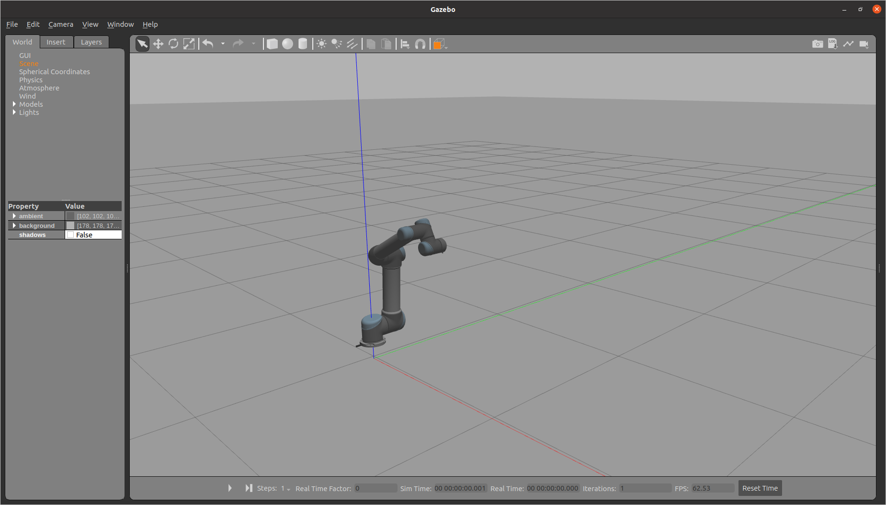
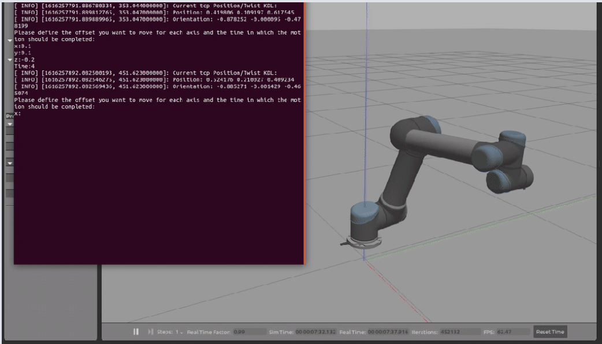

# Voraustzungen für die Nützung der Roboter-Simulaion.

1. Ros Noetic installieren 

- **Hinweß**: Um eine fehlerfreie Installation durchzuführen, wird **Ubuntu 20.04(Focal)** als Betriebsystem vorgeschlagen.

die nachfolgenden Schritten sid auch [hier](http://wiki.ros.org/noetic/Installation/Ubuntu) verfügbar.

```bash
#richten wir zuerst unseren Betriesystem so ein, dass er ROS Pakete akzepiert.
sudo sh -c 'echo "deb http://packages.ros.org/ros/ubuntu $(lsb_release -sc) main" > /etc/apt/sources.list.d/ros-latest.list'

#richten wir einen Schlüssel ein.
sudo apt install curl # falls du curl noch nicht installiert hast
curl -s https://raw.githubusercontent.com/ros/rosdistro/master/ros.asc | sudo apt-key add -

#führen wir jetzt die Installation.
sudo apt update
sudo apt install ros-noetic-desktop-full

#jetzt richten wir die Umgebung ein.
echo "source /opt/ros/noetic/setup.bash" >> ~/.bashrc
source ~/.bashrc.

# jetzt Abhängigkeiten zum Erstellen von Paketen
sudo apt install python3-rosdep python3-rosinstall python3-rosinstall-generator python3-wstool build-essential
sudo apt install python3-rosdep
sudo rosdep init
rosdep update
```

Wir sind jetzt startklar!!!

2. Eine Katkin-Umgebung einrichten.

Um mehr über Katkin zu erfahren, dann [hier](https://github.com/ros/catkin)

```bash
#Catkin instalieren
sudo apt-get install ros- noetic -catkin
sudo apt-get install cmake python-catkin-pkg python-empy python-nose python-setuptools libgtest-dev build-essential
mkdir build && cd build && cmake ../ && make && sudo make install

# catkin Arbeitsbereich starten.
mkdir -p ~/catkin_ws/src
cd ~/catkin_ws/
catkin_make

#danach (in Verzeichniss catkin_ws/)
source devel/setup.bash #das muss auf jede Terminalfenster durchgeführt werden, die neu geöffnet wird.
#oder dem Bash einfach hinzufügen 
echo "source devel/setup.bash" >> ~/.bashrc
source ~/.bashrc.
```
3. Gazebo

fals Gazeb noch nicht Installiert ist (sollte aber schon sein, wenn ROS vorhanden ist):

```bash
curl -sSL http://get.gazebosim.org | sh
```

4. Roboter-Simulation

```bash
#In der catkin-Umgebung clonen wir zuerst das universal-robot Repository
~/catkin_ws/src$ git clone -b melodic-devel https://github.com/ros-industrial/universal_robot.git  #das Repository hat nur das Paket für die Melodic Version von ROS, die aber einwandfrei mit noetic funktioniert.

~/catkin_ws/src$ cd ..
rosdep update
rosdep install --rosdistro $ROS_DISTRO --ignore-src --from-paths src

#danach bauen wir die Umgebung und Starten wir diese.

~/catkin_ws$ catkin_make
~/catkin_ws$ source devel/setup.bash        #fals es dem Bash nich hinzugefügt wurde.

```
Danach starten wir den Roboter zusammen mit ros_control

```bash
~/catkin_ws/src$ git clone https://github.com/dairal/ur5-joint-position-control.git
sudo apt-get install ros-$ROS_DISTRO-ros-control ros-melodic/noetic-ros-controllers

#Dann die Umgebung noh mal bauen
~/catkin_ws/src$ cd ..
~/catkin_ws$ catkin_make
~/catkin_ws$ source devel/setup.bash

```
wir müssen jetzt auch die Steuerung des Roboters mit der Tcp- Regler einrichten

```bash
~/catkin_ws/src$ git clone https://github.com/dairal/ur5-joint-position-control.git
~/catkin_ws/src$ git clone https://github.com/dairal/ur5-tcp-position-control.git


#die Umgebung noch mal bauen
~/catkin_ws/src$ cd ..
~/catkin_ws$ catkin_make
~/catkin_ws$ source devel/setup.bash
```
danach starten wir den Roboter in Gazebo

```bash
~/catkin_ws$ source devel/setup.bash
~/catkin_ws$ cd src/
~/catkin_ws/src$ roslaunch ur5-joint-position-control ur5_gazebo_position_control.launch
```
- **Hinweis**:  UR5 Roboterarm am Boden und die Simulation ist pausiert. Wenn wir auf den Play-Button in der unteren Leiste klicken, bewegt sich der Roboter zu der Startposition.</br>
Das Bild zeigt den pausierten Roboter:
 

Nun können wir den tcp-Positionsregler den wir vorher gebaut haben starten:

```bash
#in einem anderen Terminal
~/catkin_ws$ source devel/setup.bash
~/catkin_ws$ cd src/
~/catkin_ws/src$ rosrun ur5-tcp-position-control  tcp_position_controller
``` 

- **Hinweis**: in den Verzeichniss [catkin_doku](../../Buffer/catkin_doku/) sind auch alle diese Dateien vorhanden.

das Egebniss sieht dann so aus:
.

5. bereiten wir den Roboter vor, so dass er seine Position, während er sich bewegt, an hono schicken kann.

Es wurde dafür eine Mqtt-Client geschrieben, die die Positionen aus einer Datei extrahiert und in einem JSON-format konvertiert und die dann an hono schikt. um mehr darüber zu erfahren --> [mqtt-client](../mqtt-client_vorausetzungen/mqtt_verbindung_hono.cpp). </br></br>

Um die Informationen des Roboters in einem Datei dann zu bekommen, mussen einiges an dem datei **ur5_cartesian_position_controller.cpp**. Die ist normalerweise in dem Verzeichnis **~/catkin_ws/src/ur5-tcp-position-control/src/ur5_cartesian_position_controller.cpp**, wenn alle schritte oben richtig durchgeführt sind.</br>
Die datei [ur5_cartesian_position_controller.cpp](../../Buffer/catkin_doku/ur5_cartesian_position_controller.cpp) in dem Verzichnis [Buffer](../../Buffer/) enthält alle notwendige Anpassungen( mit **Hinzugefügt** kommentiert),um alle Positionen jedes Mal wenn sich der Roboter bewegt, in einer Datei zu speichern, die spater von dem mqtt-client benutzt wird.

Beispielwerte in der Datei sehen dann so aus:
```sql
-12.2557 -75.27 201.294 -141.479 -0.31083 -9.42477
```
# Nächster Schritt

1. Machen wir in die Datei [mqtt-client](../mqtt-client_vorausetzungen/mqtt_verbindung_hono.cpp). Weiter. oder 

2. die [Voraussetzungen für die Nützung Eclipse Ditto](../Ditto_Vorausetzungen/README.md), und die [Voraussetzungen für die Nützung von Hono](../Hono_Vorausetungen/README.md) **müssen** erst duchgeführt werden bevor man wieder die Schritte in [README.md](../../README.md) weiterführen kann.
